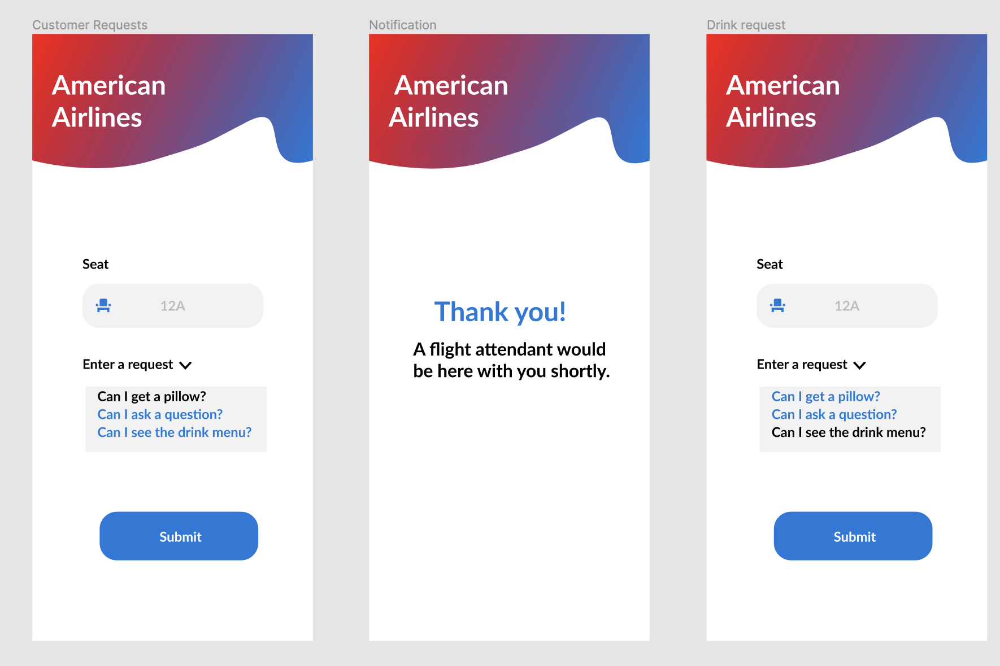

# APP - _AirDelivery App_

## Overview

Description

**AirDelivery** American Airlines travelers have the issue of not having a centralized place for making requests to flight attendants, in effect, the travelers have to wait at an interval amount of time to be able to place a request. These travelers also never know what's on the flight's amenities, this will also help slow the transmission of diseases.

Goal

**AirDelivery** To have a centralized app for travelers to queue in requests for flight attendants, ultimately leading to a better traveling experience.

App Evaluation

• Category: Travel Utility App

• Mobile: This app would be primarily developed for mobile but would perhaps be just as viable on a computer. Functionality wouldn't be limited to mobile devices, however mobile version could potentially have more features.

• Story: Users can send a request to the flight attendant.
Flight attendants will be able to see the incoming requests.

• Market: Any individual between the age of 14 and older could choose to use this app,

• Habit: This app could be used as often or unoften as the user wanted when they are flying to American Airlines

Time spent: **24** hours spent in total

## User Stories

The following **required** functionality is completed:

- [ ] User logs in their seat number
- [ ] User picks what their desired to request
- [ ] User submit their request
- [ ] User get a thank you request
- [ ] User can purchase their food
- [ ] User enter their card Information

## Wireframe

Here's a Wireframe of implemented user stories:

</img>
